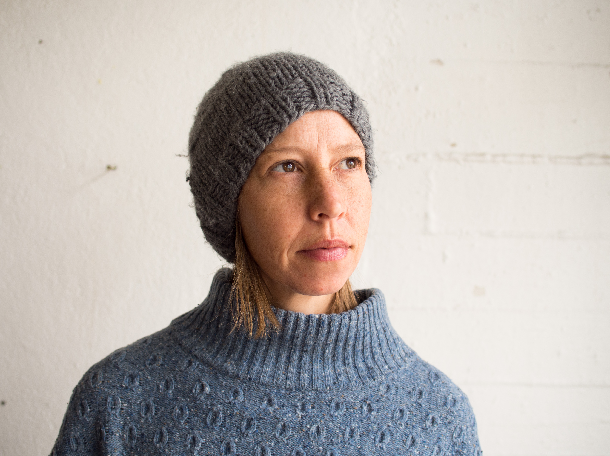
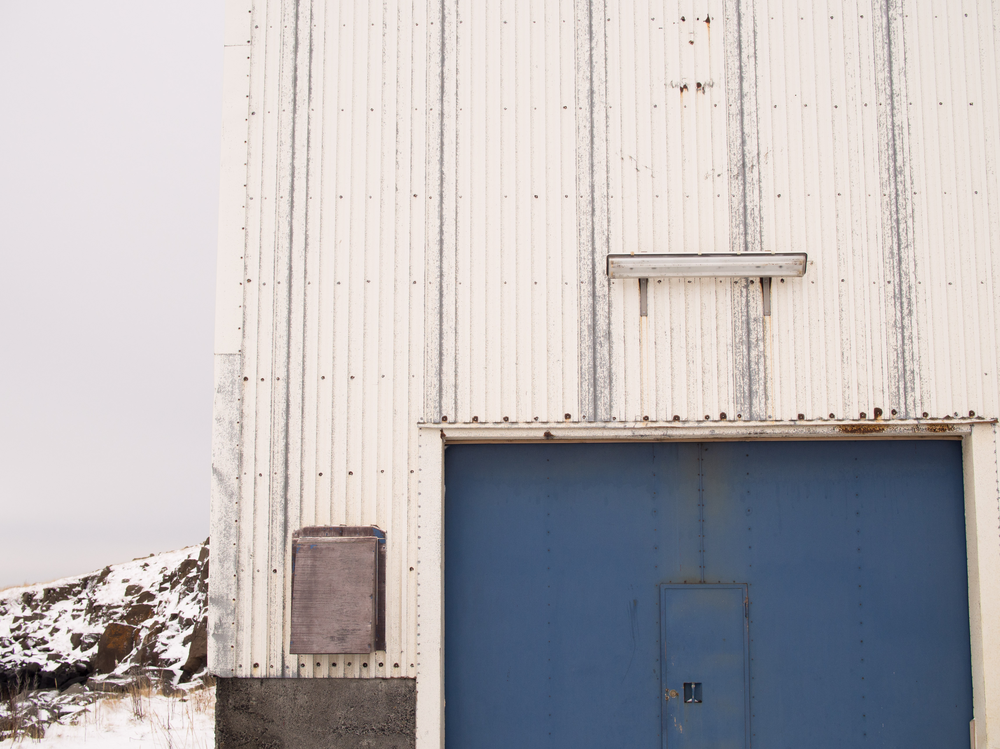

  

    
  

  

    <h1>Marian Reid</h1>

    I’m a writer and storyteller with a background in communication for non-government organisations (NGOs). I work globally with communities to tell stories that give voice to marginalised people and forgotten places. I’m interested in how people and the environment respond to extreme situations, and the place of culture in development.

    
  
      <h2>Contact</h2>

      <a href="mailto:marianchristabel@gmail.com"><i class="fa fa-envelope right-gap" aria-hidden="true"></i>marianchristabel@gmail.com</a> 
      <a href="tel:+61(0)439274953"><i class="fa fa-phone-square right-gap" aria-hidden="true"></i>+61(0)439274953</a>   
      <a href="https://www.instagram.com/marianchristabel/"><i class="fa fa-instagram right-gap" aria-hidden="true"></i>marianchristabel</a> 

    

  

  

    
  

  

   <h2>Communications</h2>

   As a Communication Specialist, I produce compelling content for NGOs that tell stories of need, hope and change. I spend time with women, men and children from all backgrounds and support them to tell their stories and be heard.

   

   <ul>
   <li><a target="blank" href="content/Oxfam.pdf">Oxfam Australia</a></li>
   <li><a target="blank" href="content/STC.pdf">Save the Children Australia</a></li>  
   </ul>
   

   

   I also facilitate storytelling workshops that draw on digital storytelling, the Photovoice method and participatory media.
   Recent projects include <a target="blank" href="http://www.slq.qld.gov.au/showcase/ASSI/memories-of-a-forgotten-people">Digital storytelling with the Australian South Sea Islander community in Brisbane</a>
   and <a target="blank" href="http://manyhands.org.au/our_activities/past_projects/photo_voice_project_november_2013">Photovoice with Many Hands International in Timor-Leste</a>
   

  

  

    
  

  

    <h2>Creative</h2>

    

    My creative work is informed by place, people and culture. I’m interested in tracing traditional practices in modern times, curious about the past life of buildings in strange places, and always seeking stories that shape the identity of a community.
    

     
    

    <a target="blank" href="http://neslist.is/">NES Artist Residency</a> in Iceland. A series of <a target="blank" target="blank" href="content/NES.pdf">short works</a> in response to the small fishing village of Skagaströnd.
    

    

    Cultural voice and visibility in Fataluku country, Timor-Leste. Exploring the intersection of intangible cultural heritage, development and multimedia.
    

    

    I have also written for BBC World Travel on my experiences horse trekking in
    <a target="blank" href="http://www.bbc.com/travel/story/20130614-the-way-of-the-shepherd-horse-trekking-through-kyrgyzstan">Kyrgyzstan</a>
    and desert architecture in
    <a target="blank" href="http://www.bbc.com/travel/story/20140604-chasing-shadows-and-light-in-iran">Iran</a>, among other travel stories.
    

  

