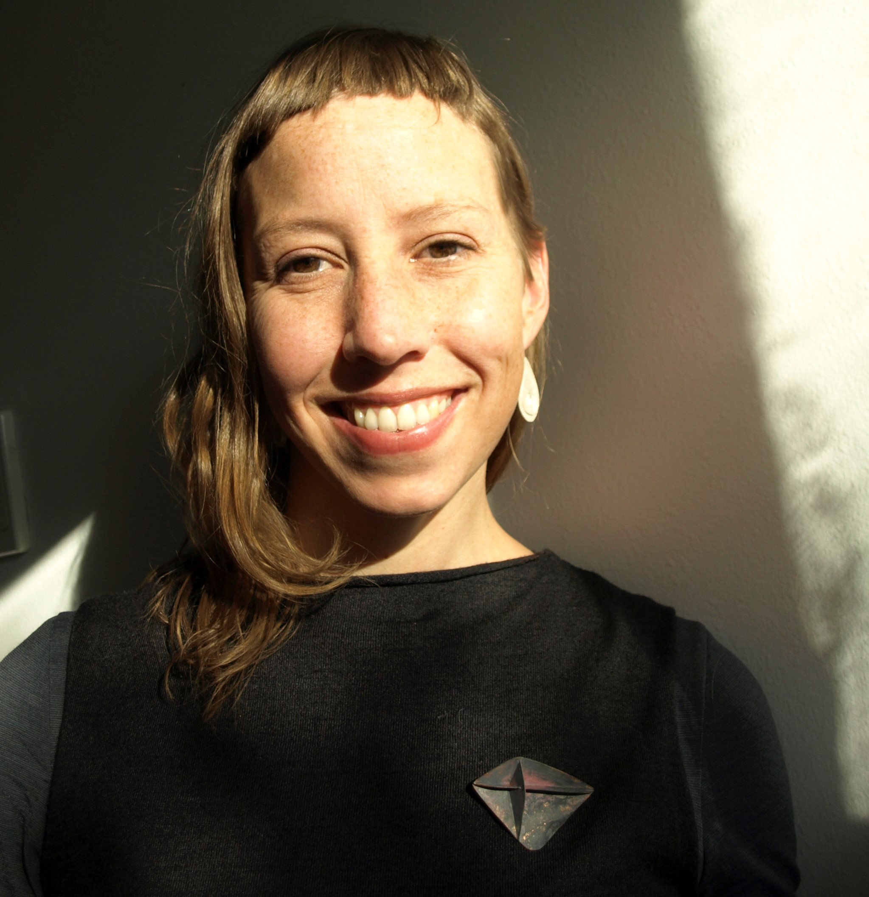
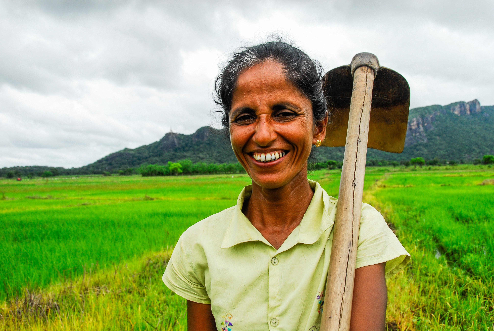
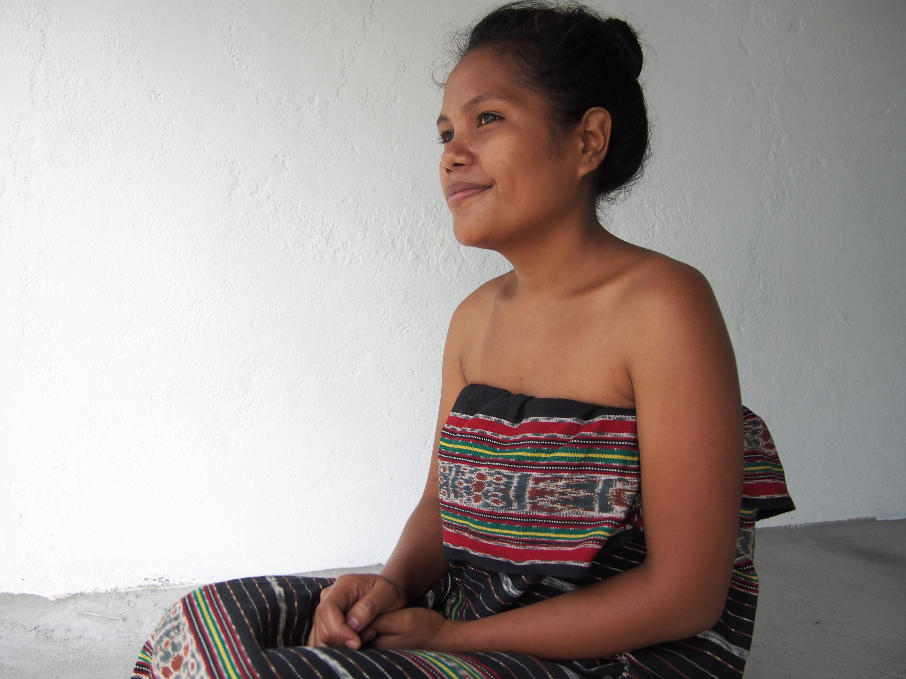

  

    
  

  

    <h1>Marian Reid</h1>

    I’m a writer and storyteller with a background in communication for non-government organisations (NGOs). I work globally with communities to tell stories that give voice to marginalised people and forgotten places. I’m interested in how people and the environment respond to extreme situations, and the place of culture in development.

    

      <h2>Contact</h2>

      <a href="mailto:marianchristabel@gmail.com"><i class="fa fa-envelope right-gap" aria-hidden="true"></i>marianchristabel@gmail.com</a> 
      <a href="tel:+61(0)439274953"><i class="fa fa-phone-square right-gap" aria-hidden="true"></i>+61(0)439274953</a>   
      <a href="https://www.instagram.com/marianchristabel/"><i class="fa fa-instagram right-gap" aria-hidden="true"></i>marianchristabel</a> 

    

  

  

    
  

  

   <h2>Communications</h2>

    As a Communication Specialist, I produce compelling content for NGOs. I’ve worked with
    <a target="blank" href="content/Our_health_our_way_Oxfam.pdf">Oxfam Australia</a> and
    <a target="blank" href="content/The_F_word_we_shouldnt_use_STC.pdf">Save the Children</a> to tell stories of need, hope and change. I’ve also facilitated digital storytelling workshops with the Australian South Sea Islander community, run a Photovoice project with Fataluku people in Timor-Leste, and gathered stories from forest-dependent communities in Ethiopia.
    I spend time with women, men and children from all backgrounds and support them to tell their stories and be heard.

  

  

    
  

  

    <h2>Creative</h2>

    My creative work is informed by place, people and culture. I recently spent two months in Iceland with NES Artist Residency where I created a series of short works in response to the small fishing village of Skagaströnd. I have researched and written on cultural voice and visibility in Timor-Leste. I have also written for <a target="blank" href="http://www.bbc.com/travel/story/20130614-the-way-of-the-shepherd-horse-trekking-through-kyrgyzstan">BBC World Travel</a> on several occasions.

  

